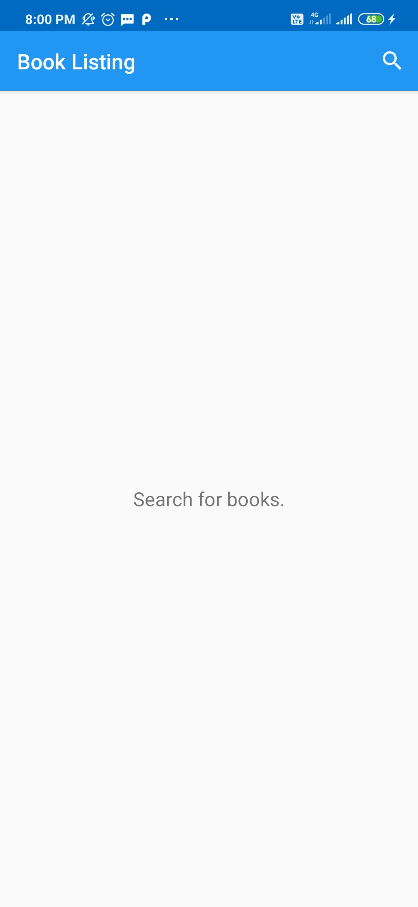
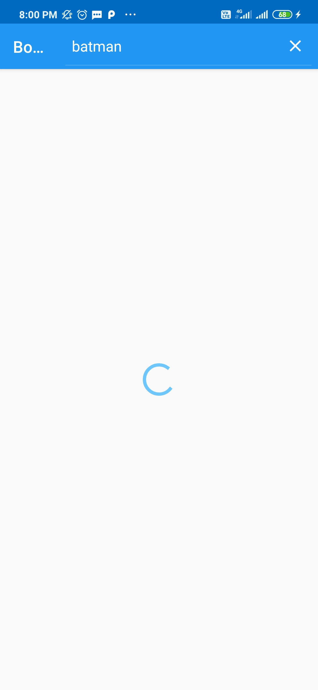
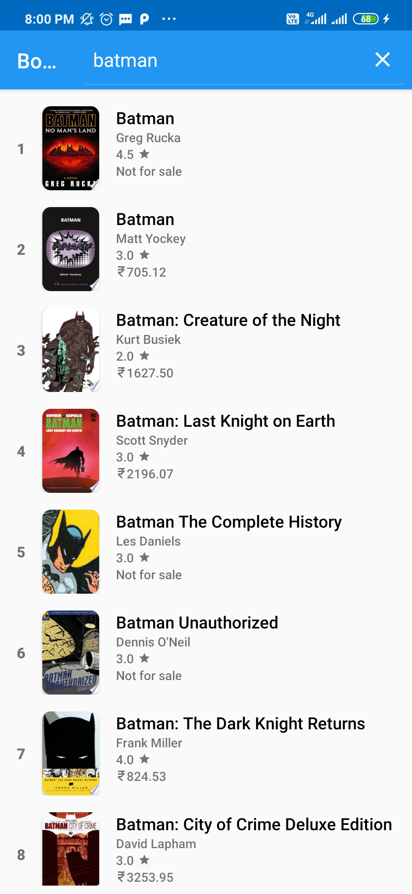
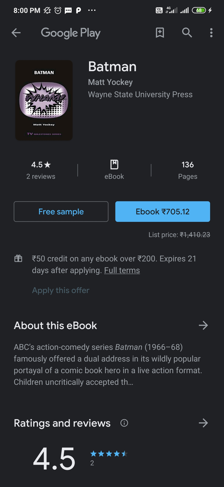

Book Listing App
===================================

This app fetches lists of books from google books server.
Used in a Udacity course in the Beginning Android Nanodegree.

API used
=====

https://www.googleapis.com/books/v1/volumes

## Screenshots

<table>
<tr>
<td></td>
<td></td>
</tr>
<tr>
<td></td>
<td></td>
</tr>
</table>
